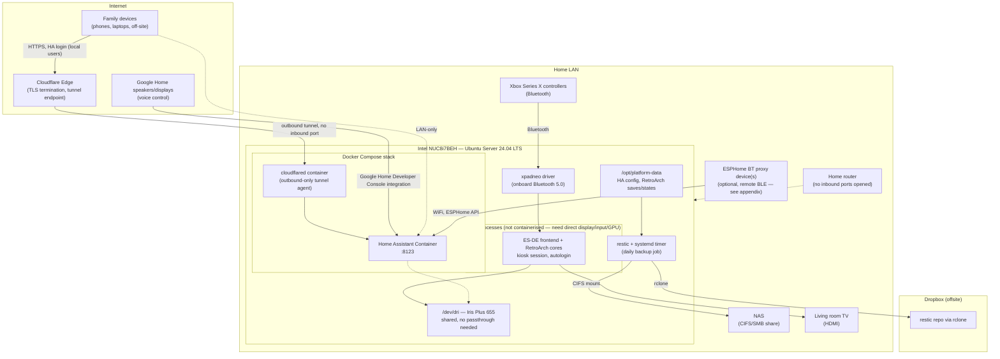

# Logical Architecture

Single host, no hypervisor. The iGPU (Iris Plus 655) is shared by device node (`/dev/dri`), not virtualization passthrough — there's nothing to isolate since there's no discrete GPU.

## Authentication and identity — where it sits

| Boundary | Mechanism | Notes |
|---|---|---|
| Family → Home Assistant (local or remote) | HA's own local user accounts | Single identity system for all access paths — remote access via Cloudflare Tunnel doesn't add a second login, it's the same HA auth screen |
| Remote reachability | Cloudflare Tunnel | Outbound-only from the NUC — no inbound firewall/router rule. Cloudflare terminates TLS at its edge, then proxies to the NUC over the tunnel. Cloudflare sees encrypted-in-transit traffic but is a party in the path (this trade-off was chosen deliberately over WireGuard for family UX — see prior discussion) |
| Google Home voice control | Google Home Developer Console (service account) ↔ HA `google_assistant` integration | No Nabu Casa dependency since self-hosted was preferred; this path replaced the deprecated "Actions on Google" console |
| GitHub | `fdm2k` account, SSH deploy key scoped to this repo only (not full-account key) | Generated on the NUC, private key never leaves it |
| NAS backup | CIFS credentials file, `chmod 600`, root-only, git-ignored | Not a shared identity with anything else |
| Dropbox backup | rclone OAuth token, git-ignored | Scoped to a single Dropbox App folder, not full-account access |
| Local admin | SSH, LAN-only, key-based | No WAN exposure — this was an explicit requirement |

## Containerisation layout

Only Home Assistant and the Cloudflare Tunnel agent are containerised (Docker Compose, one stack, private bridge network between the two containers). The emulation frontend runs directly on the host OS because it needs the display server, audio, and controller input paths that don't gain anything from containerisation here — the earlier "GPU passthrough" framing was virtualisation terminology; what's actually happening is both HA (rarely) and ES-DE/RetroArch (constantly) share the same `/dev/dri` device node on one shared OS.
